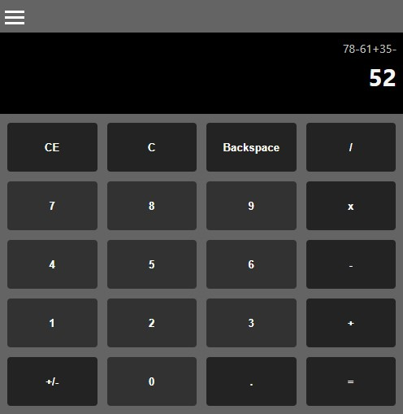
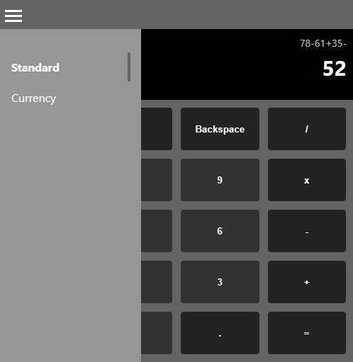
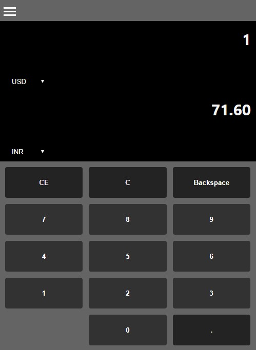

# Calculator
This is a simple web app completely built using React and Redux. It currently has two types of calculators:
- Standard Calculator
- Currency Converter

Routing is used to display the multiple calculators within the same layout. A sidebar is there which has the navigation links to the Standard Calculator and Currency Converter. The button panel of the calculator has been designed using `CSS Grid Layout`.

## Standard Calculator
The standard calulator has basic functions like addition, subtraction, multiplication, division, etc. This besides calculating, also displays the ongoing calculation till the time you finally press `equals to` operator. You can chain multiple operations like `10-2+25*3/2`

## Currency Converter
The Currency Converter, as the name suggests, shows the converted value of a particular currency in a different currency. This fetches the current conversion rates from https://api.exchangeratesapi.io/ using the axios library.
 
Redux Thunk is being used as middleware to handle the dispatch actions to the web.
  

## Libraries used:
- react
- react-dom
- redux
- react-redux
- react-router-dom
- react-scripts
- axios
- redux-thunk

## Images
  
  
 

